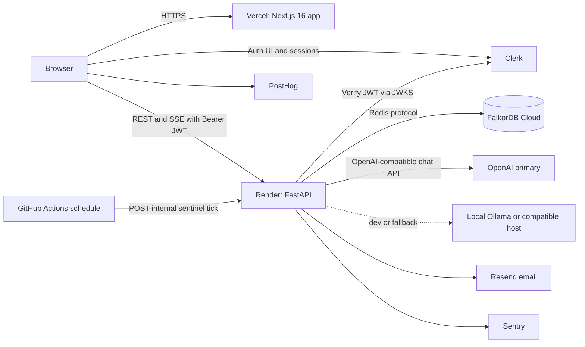
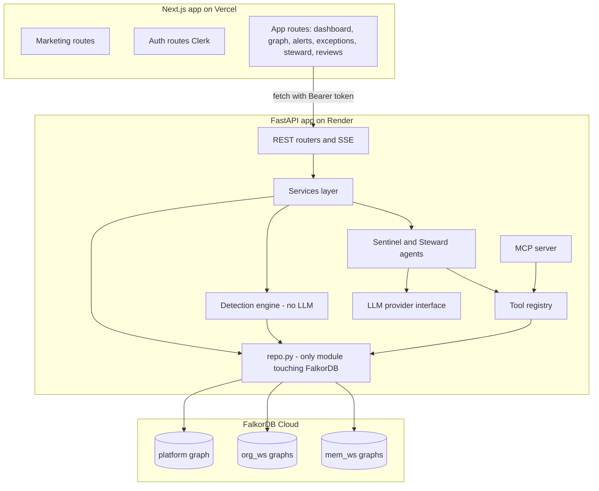
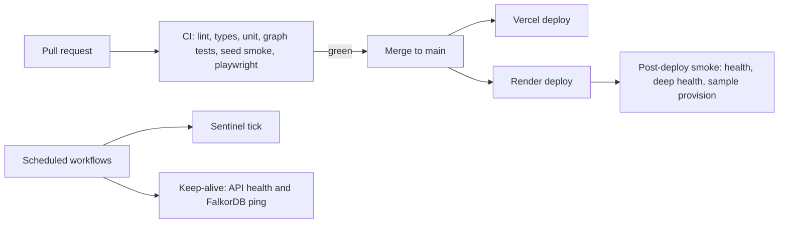

# 02 — Tech Stack and Architecture

| Field | Value |
| --- | --- |
| **Version** | 1.0 (draft for build kickoff) |
| **Date** | 2 Oct 2026 |
| **Depends on** | `01-PRD.md` |
| **Feeds** | `03-backend-database-schema.md`, `06-implementation-plan.md` |

> **Version policy.** Majors below were checked on 2 Oct 2026. Exact versions are decided on build day 1, committed in lockfiles, and **not upgraded during the event window except for security patches** (Next.js ships security releases roughly monthly). Anything marked **Verify** must be confirmed against live docs at kickoff.

---

## 1. Principles

1. **Graph-first, LLM-second.** FalkorDB holds all domain data and memory; the LLM only narrates and plans.
2. **Boring technology.** Plain tool-calling loop, FastAPI, Next.js App Router, no agent frameworks in the core.
3. **Contracts before code.** Pydantic models and tool signatures first; stubs satisfy them.
4. **One source of truth per concern.** Identity in Clerk, domain in FalkorDB, secrets in environment variables.
5. **Free tiers are for development, not for customer data.** Production data sits on paid, TLS-protected, backed-up infrastructure.
6. **Everything the demo depends on works without the LLM.**

---

## 2. Platform constraints that shape the design (verified)

| # | Constraint | Impact on design | Mitigation |
| --- | --- | --- | --- |
| C1 | **FalkorDB Cloud Free:** 100 MB RAM (also the dataset cap), **no TLS, no persistence, no backups**; free instances unused for a day are stopped and deleted after seven days | Graph data can disappear. Credentials and traffic are unencrypted on the wire. | Dev/event only with synthetic data. Keep-alive ping every 12 h. Rehydrate path (seed + bundle). Paid Startup tier (from about $73/month, includes TLS and automated backups) before any real customer data. |
| C2 | **Render free web service:** spins down after 15 minutes idle; cold start roughly 30–60 s; 750 instance hours per workspace per month; ephemeral disk; no custom domain on free | First request after idle is slow; no local state; no background worker | Pre-warm from the landing page; explicit "waking up" UI; all state in FalkorDB; no workers (scheduler is external); paid instance before public beta |
| C3 | **Vercel Hobby:** personal/non-commercial use; cron only once per day, within the hour | Cannot run Sentinel frequently from Vercel cron; commercial launch needs Pro ($20 per seat per month) | Use **GitHub Actions** scheduled workflows to call the API; upgrade to Pro for commercial launch |
| C4 | **FalkorDB is a Cypher subset** with proprietary extensions: no label expressions `(n:A\|B)`, no regex operator, procedure arguments differ from Neo4j | Queries must be written for FalkorDB and tested against the pinned version | Day-1 spike; one test per query; never copy Neo4j snippets blindly |
| C5 | **Constraints:** unique constraints need a supporting range index on exactly the same properties; enforced only when all constrained properties are non-null | Schema bootstrap must create indexes first (the Python client's `create_node_unique_constraint` creates missing range indexes) | `schema.py` is idempotent and verified in tests |
| C6 | **Open engine issues were reported recently:** a crash with fixed-length variable path expressions combining `nodes()` with `size(relationships())` in `WHERE`; slow bulk writes under unique constraints in a Rust-based build | Pin the server image tag; avoid that expression pattern; batch writes (at most 500 rows per `UNWIND`) | Spike item S-9, S-10 (`06` §3) |
| C7 | **Property values are scalars or arrays of scalars** (no nested maps) | Blobs are stored as JSON strings with a `_json` suffix and are not queryable | Convention in `03` §2 |
| C8 | **Next.js 15 reaches end of support on 21 Oct 2026; 16.x is current** | Start on 16.x | Pin 16.x and patch security releases |

---

## 3. Architecture

### 3.1 System context



### 3.2 Container view



### 3.3 Request paths

| Path | Flow |
| --- | --- |
| **Page load** | Browser → Vercel (Next.js, Clerk `proxy.ts` — Next 16's renamed middleware — gates `/w/**`) → HTML/JS; data fetched client-side via TanStack Query from the API. |
| **API call** | Browser attaches Clerk session JWT as `Authorization: Bearer`. API verifies signature (JWKS cached), loads membership, derives graph names, checks role, runs named queries. |
| **Streaming** | Chat and workspace events use SSE over `fetch` (headers supported). Heartbeat comment every 15 s to keep proxies open. |
| **Scheduled run** | GitHub Actions calls `POST /internal/sentinel/tick` with a shared secret; API runs Sentinel for dirty or stale workspaces. |
| **Pre-warm** | Landing page fires a `GET /health` to wake Render before the visitor reaches sign-up. |

### 3.3.1 Why the browser calls the API directly
No BFF proxy: fewer moving parts, native SSE, no double hop on a cold Render instance. CORS is locked to the web origin. Because auth uses a Bearer header (not cookies), classic CSRF does not apply to the API.

---

## 4. Stack decisions

### 4.1 Frontend

| Concern | Choice | Why | Rejected |
| --- | --- | --- | --- |
| Framework | **Next.js 16 (App Router), React 19, TypeScript (strict)** | Required by owner; SSR/SEO for landing; Vercel-native | Streamlit (not a product UI) |
| Styling | **Tailwind CSS v4** with CSS variable tokens | Fast, token-driven, matches shadcn | CSS-in-JS |
| Components | **shadcn/ui** (Radix primitives) + custom components | Owned code, accessible primitives, themable | Material UI (heavy, hard to make distinctive) |
| Icons | **lucide-react** | shadcn default; consistent stroke | Mixed icon sets |
| Motion | **motion** (framer-motion successor) + CSS transitions | Orchestrated sequences, reduced-motion support | GSAP (licensing/size) |
| Server state | **TanStack Query** | Caching, retries, optimistic updates | Redux |
| Client state | **Zustand** (small UI state only) | Minimal | Context sprawl |
| Forms | **React Hook Form + Zod** | Typed validation shared with API shapes | Formik |
| Tables | **TanStack Table** | Headless; fits shadcn | AG Grid (heavy) |
| Charts | **Recharts** via shadcn chart wrappers; custom SVG for Expiry Runway and Score Ring | Simple data viz | D3-only (slow to build) |
| Graph view | **react-force-graph-2d** (canvas) | Fast to ship, supports path highlighting; fine up to a few hundred nodes | Cytoscape.js (heavier API), Sigma.js (consider if above 1,000 nodes), React Flow (diagram-oriented) |
| Streaming | **@microsoft/fetch-event-source** | SSE with headers and POST | Native `EventSource` (no headers) |
| Auth UI | **@clerk/nextjs** with `appearance` theming | Handles sign-up, email verification, reset, bot protection | Hand-rolled auth |
| Toasts | **sonner** | shadcn standard | — |
| Command palette | **cmdk** (shadcn Command) | Cmd+K search | — |
| Theme | **next-themes** (class strategy) | Dark/light with system default | — |
| Markdown | **react-markdown + rehype-sanitize** | Safe rendering of agent output | `dangerouslySetInnerHTML` |
| Dates | **date-fns** | Small; tree-shakable | Moment |
| Fonts | **next/font/google**: Bricolage Grotesque, Instrument Sans, JetBrains Mono | See `05` §4 | — |
| Testing | **Vitest + Testing Library**, **Playwright** (+ axe) | Unit, e2e, accessibility | Cypress |
| Lint/format | **ESLint, Prettier**, `tsc --noEmit` | Standard | — |

### 4.2 Backend

| Concern | Choice | Why |
| --- | --- | --- |
| Language/runtime | **Python 3.12** | Per blueprint; stable ecosystem |
| Package manager | **uv** with lockfile (`uv.lock`) | Fast, reproducible (fallback: pip-tools) |
| API framework | **FastAPI + Uvicorn** | Async, Pydantic-native, OpenAPI for free |
| Validation | **Pydantic v2 + pydantic-settings** | Contracts and config |
| Streaming | **sse-starlette** | SSE with heartbeats |
| FalkorDB client | **`falkordb` (async via `falkordb.asyncio`)** | Official client; `ro_query` for reads; constraint helpers |
| LLM access | **`openai` SDK (Chat Completions, tool calling, JSON-schema output)** pointed at OpenAI, Ollama, or any compatible base URL | One adapter covers cloud and local |
| Auth | **PyJWT[crypto]** + cached JWKS from Clerk; **svix** for webhook signatures | Standard |
| Email | **Resend** SDK | Simple transactional email; free tier (Verify limits) |
| MCP | Official Python **`mcp`** SDK (FastMCP) | Per blueprint |
| IDs/time | **python-ulid**, epoch-second timestamps (UTC ints) | Sortable IDs; no timezone bugs |
| Config files | **PyYAML** for thresholds/weights | Per blueprint |
| Logging | **structlog** (JSON) | Request-scoped context |
| Retry | **tenacity** | LLM/network retries |
| Caching | **cachetools** (in-process TTL/LRU) | Single instance; no Redis needed |
| Rate limiting | **slowapi** (or small custom limiter) | Per-user and per-IP |
| Data generation | **faker** (seeded), **python-dateutil** | Deterministic seed |
| Testing | **pytest, pytest-asyncio, httpx, respx** | Unit, graph, contract, e2e |
| Quality | **ruff, mypy (strict on app/)** | Fast feedback |

### 4.3 Data

| Concern | Choice | Notes |
| --- | --- | --- |
| Primary store | **FalkorDB** (graphs: `platform`, `org_<ws>`, `mem_<ws>`) | Central to the product; per-tenant graphs |
| Dev server | Docker image `falkordb/falkordb:v4.22.0` (pinned, see `docs/spike-notes.md`) (ports 6379, 3000 Browser) | Do not use `latest` |
| Cloud | **FalkorDB Cloud Free** for dev/event; **Startup** (TLS, backups) for real data | See C1 |
| Identity | **Clerk** (users, sessions, email verification, password reset) | Not stored in FalkorDB beyond a `User` mirror node |
| Object storage | None in R0–R1; bundle exports are downloaded by users | Add S3-compatible storage if scheduled backups are required |

### 4.4 AI

| Concern | Choice |
| --- | --- |
| Primary provider | **OpenAI** via Chat Completions (tool calling, JSON-schema outputs). Model names are env-configured (Verify current models at kickoff; require tool calling and structured output). |
| Local mode | **Ollama** (OpenAI-compatible at `http://localhost:11434/v1`) with a tool-calling-capable open model. **Works only where the backend can reach it** (your machine or a tunnel); a Render-hosted API cannot reach your laptop. |
| Production fallback | A second OpenAI-compatible host (for example a hosted open model) via `COMPAT_*` env vars, or a smaller OpenAI model. |
| Agent framework | **None** in core: a plain tool-calling loop. LangGraph optional only for two-agent orchestration. |
| Rejected for core | GraphRAG-SDK, QueryWeaver, LlamaIndex (auto-extracted or text-to-Cypher graphs conflict with the deliberate ontology); Graphiti/Cognee kept as reading references only. |

### 4.5 Infrastructure and delivery

| Need | Choice | Notes |
| --- | --- | --- |
| Frontend hosting | **Vercel** (Hobby for dev/event; Pro for commercial) | Preview deployments per PR |
| Backend hosting | **Render** web service (free for dev/event; paid instance for public beta) | Dockerfile or native Python build |
| Scheduling | **GitHub Actions** (`schedule`) | Sentinel tick every 15–30 min; keep-alive every 12 h; best-effort timing |
| CI | **GitHub Actions** | Lint, type-check, unit/graph tests (FalkorDB service container), seed smoke test, Playwright on PRs |
| Repro | `docker-compose.yml`, `Makefile`, `.env.example` | From blueprint appendices |
| Secrets | Vercel and Render environment settings; GitHub Actions secrets | Never in the repo |
| Dependency hygiene | Dependabot, `pip-audit`, `npm audit` | Weekly |

### 4.6 Observability and product analytics

| Need | Choice |
| --- | --- |
| Errors | **Sentry** (frontend and backend) |
| Product analytics | **PostHog** (consent-aware; no PII in event properties) |
| Logs | structlog JSON to stdout (Render log stream) |
| Uptime | GitHub Actions ping plus a free uptime monitor (Verify) |

---

## 5. Version and dependency policy

| Component | Target major (2 Oct 2026) | Policy |
| --- | --- | --- |
| Next.js | 16.x (16.3 line current) | Pin exact; apply security patches only during the event |
| React | 19.x | Pin with Next |
| Tailwind CSS | 4.x | Pin |
| shadcn/ui | CLI-generated source | Components are copied into the repo; review diffs on regeneration |
| Node | Active LTS (Verify Vercel runtime) | `.nvmrc` + `engines` |
| Python | 3.12 | `.python-version` |
| FastAPI, Pydantic | latest v0.x/v2 at kickoff | Lockfile |
| `falkordb` client | latest at kickoff | Lockfile |
| FalkorDB server | A specific tagged release | Run the S-spikes on the exact tag; record the tag in README |
| `openai` SDK | latest at kickoff | Lockfile |

Rules: lockfiles committed; no drive-by upgrades; one dependency PR per week after launch; upgrade the FalkorDB tag only with a full test and eval run.

---

## 6. Repository structure and structural rules

Monorepo (matches the blueprint with additions for the real product).

```
reprieve/
├── README.md  LICENSE  Makefile  docker-compose.yml  .env.example  CLAUDE.md
├── docs/                       # 01..06 + adr/ + blueprint.md
├── data/
│   ├── seed/                   # org.json services.json controls.json exceptions.json threads/*.txt
│   └── ground_truth.json
├── backend/
│   ├── pyproject.toml  uv.lock
│   └── app/
│       ├── main.py  config.py
│       ├── models/             # Pydantic: entities, alerts, tool I/O, API schemas
│       ├── graph/              # client.py schema.py repo.py queries/*.cypher
│       ├── ingest/             # loaders.py importers.py extractor.py resolver.py
│       ├── detection/          # rules.py algorithms.py scoring.py engine.py proof.py
│       ├── agents/             # llm.py sentinel.py steward.py tools.py prompts/*.md guard.py
│       ├── memory/             # store.py precedent.py
│       ├── services/           # workspaces.py reviews.py exceptions.py notifications.py
│       ├── mcp_server/         # server.py
│       ├── auth/               # clerk.py rbac.py webhooks.py
│       └── api/                # routers per area (see 03 §10)
├── frontend/
│   ├── app/
│   │   ├── (marketing)/        # landing, security, legal
│   │   ├── (auth)/             # sign-in, sign-up
│   │   ├── (onboarding)/onboarding/
│   │   └── (app)/w/[ws]/       # home graph alerts exceptions services people reviews steward memory rules sources activity settings
│   ├── components/             # ui/ (shadcn) + product components (GraphView, ProofPath, ScoreRing, ExpiryRunway…)
│   ├── lib/                    # api.ts, sse.ts, tokens.ts, analytics.ts
│   └── styles/globals.css      # design tokens (05 §3)
├── scripts/                    # seed_graph.py generate_seed.py demo_reset.py dump_graph.sh
├── eval/                       # run_eval.py report.md
└── .github/workflows/          # ci.yml  sentinel-tick.yml  keepalive.yml
```

**Structural rules (enforced by review and import-lint):**

1. `detection/` never imports `agents/` and never calls an LLM.
2. Only `graph/repo.py` talks to FalkorDB; no Cypher outside `graph/queries/*.cypher`.
3. Labels and relationship types in queries come only from code constants, never from user input.
4. Only `agents/tools.py` is exposed to the LLM (directly or via MCP); write-capable actions require human approval.
5. API routers contain no business logic; services orchestrate; repo persists.
6. Graph names are built by one function from a validated workspace ID.

---

## 7. Environments and configuration

| Environment | Frontend | API | FalkorDB | Notes |
| --- | --- | --- | --- | --- |
| Local | `next dev` | `uvicorn --reload` | Docker container | `make up` |
| CI | — | pytest | Service container | Seeds and runs graph tests |
| Preview (PR) | Vercel preview | Shared staging API | Cloud free, `GRAPH_PREFIX=stg_` | Optional |
| Production | Vercel | Render | Cloud (Startup before real data), `GRAPH_PREFIX=prod_` | Prefix keeps environments apart on one instance |

### 7.1 Environment variables

**Backend (`.env`)**

| Variable | Purpose |
| --- | --- |
| `ENV_NAME`, `GRAPH_PREFIX` | Environment label; prefix for all graph names |
| `FALKORDB_HOST`, `FALKORDB_PORT`, `FALKORDB_USERNAME`, `FALKORDB_PASSWORD`, `FALKORDB_TLS` | Connection (TLS true on paid tier) |
| `CLERK_JWKS_URL`, `CLERK_ISSUER`, `CLERK_WEBHOOK_SECRET` | Auth verification |
| `WEB_ORIGIN` | CORS allowlist |
| `INTERNAL_TICK_SECRET` | Shared secret for scheduler calls (header `X-Internal-Secret`) |
| `LLM_PRIMARY` (`openai` or `local` or `compat`), `LLM_FALLBACK` (`none` or `local` or `compat`) | Provider routing |
| `OPENAI_API_KEY`, `OPENAI_MODEL_AGENT`, `OPENAI_MODEL_FAST` | OpenAI |
| `LOCAL_LLM_BASE_URL`, `LOCAL_LLM_MODEL`, `LOCAL_LLM_API_KEY` | Ollama (dev) |
| `COMPAT_BASE_URL`, `COMPAT_API_KEY`, `COMPAT_MODEL` | Hosted fallback |
| `LLM_CACHE_TTL_S` | In-process response cache TTL (identical prompts only) |
| `LLM_TIMEOUT_S`, `LLM_MAX_TOOL_CALLS`, `LLM_DAILY_TOKEN_BUDGET_PER_WS` | Guardrails |
| `RESEND_API_KEY`, `EMAIL_FROM` | Notifications |
| `SENTRY_DSN` | Errors |
| `AS_OF_DEFAULT` | Sample workspace date (for example 2026-10-17) |

**Frontend (`.env.local`)**

| Variable | Purpose |
| --- | --- |
| `NEXT_PUBLIC_API_URL` | FastAPI base URL |
| `NEXT_PUBLIC_CLERK_PUBLISHABLE_KEY`, `CLERK_SECRET_KEY` | Clerk |
| `NEXT_PUBLIC_SENTRY_DSN`, `NEXT_PUBLIC_POSTHOG_KEY`, `NEXT_PUBLIC_POSTHOG_HOST` | Observability |
| `NEXT_PUBLIC_APP_URL` | Absolute URLs |

---

## 8. CI/CD and release



| Gate | Rule |
| --- | --- |
| Pre-merge | ruff, mypy, eslint, tsc, unit and graph tests, contract tests, Playwright smoke |
| Main branch | Always deployable; `make smoke` passes |
| Release | Tag `v0.x.y`; changelog entry; eval report attached |
| Rollback | Re-deploy the previous Render/Vercel build; graph schema changes are additive and idempotent |

Schema changes: bump `SchemaMeta.version`; migrations are idempotent Python functions run at boot (`03` §6.4).

---

## 9. Security architecture

| Threat | Control |
| --- | --- |
| Cross-tenant access | Graph name derived server-side from membership; never from client input; 404 on non-membership; tests for every router |
| Injection into Cypher | Named parameterized queries only; labels from constants; LLM cannot author Cypher |
| Prompt injection | Ingested text treated as data; extractor has no tools; schema-validated output; staged drafts need approval; tool results are structured data, not instructions |
| Hallucination | Tool-only facts; citation schema; groundedness validator |
| XSS | React escaping; `rehype-sanitize` for markdown; strict CSP; no `dangerouslySetInnerHTML` |
| CSRF | Bearer tokens in headers, no cookie auth on the API |
| Authn/z | Clerk JWT verified (signature, issuer, expiry); RBAC dependency per route; internal routes require `INTERNAL_TICK_SECRET` |
| Brute force / abuse | Clerk bot and rate protections; per-IP and per-user limits (`03` §10.7); LLM budgets per workspace |
| Data in transit | HTTPS to web/API. **FalkorDB Free has no TLS**: synthetic data only. Paid tier enables TLS (`FALKORDB_TLS=true`). |
| Data at rest | Free tier unprotected and ephemeral; paid tier with backups |
| Secrets | Environment only; rotate on suspicion; no secrets in logs |
| LLM data exposure | Send IDs, names, and short excerpts only; optional PII redaction; AI mode `private` or `off` |
| Supply chain | Lockfiles, Dependabot, `pip-audit`, `npm audit`, prompt patching of Next.js security releases |
| DoS | Query timeouts; bounded variable-length paths; render and result caps; rate limits |

---

## 10. Observability and operations

| Aspect | Design |
| --- | --- |
| Logging | JSON logs with `request_id`, `workspace_id` (hashed), `user_id` (hashed), route, latency, status |
| Tracing | Request IDs propagated to the browser (`X-Request-ID`) and into Sentry |
| Health | `GET /health` (liveness), `GET /internal/health/deep` (FalkorDB ping, schema version, LLM reachability) |
| Metrics (logged) | Rule latency per query ID, Sentinel run duration, tool-call counts, token usage, groundedness rejects |
| Alerting | Sentry error alerts; failing GitHub Actions on tick or keep-alive |
| Runbooks | (1) FalkorDB wiped: run `make rehydrate` or restore bundle. (2) LLM down: set `LLM_PRIMARY` to fallback; Quick answers keep working. (3) Render cold: warm via health call. (4) Bad deploy: roll back. |

---

## 11. Performance, capacity, and cost

### 11.1 Capacity plan
- Sample workspace (about 200 nodes and 600 edges) should occupy well under 1 MB; **measure with `GRAPH.MEMORY USAGE`** and set quotas from real numbers. At 100 MB total, the free tier supports a handful of demo workspaces, not a user base.
- Chat turn content is capped (8 KB per turn) and pruned after 90 days to protect memory.
- Algorithms (PageRank, betweenness) run per Sentinel run on the service subgraph (25–200 nodes) and are cached per `(workspace, graph version)`.

### 11.2 Cost model (indicative; Verify at kickoff)

| Item | Dev/event | Production starting point |
| --- | --- | --- |
| FalkorDB Cloud | Free | Startup from about $73/month (TLS, backups) |
| Vercel | Hobby (non-commercial) | Pro $20 per seat per month |
| Render | Free | Paid instance (Verify price) |
| Clerk, Resend, Sentry, PostHog | Free tiers (Verify limits) | Usage-based |
| OpenAI | Pay per use; set a monthly cap | Same; budget per workspace |

---

## 12. LLM architecture

```
agents/llm.py
  LLMProvider (Protocol)
    chat(messages, tools=None, response_schema=None, temperature=0, timeout=...) -> LLMResult
    stream(messages, tools=None, ...) -> AsyncIterator[LLMEvent]
  OpenAICompatProvider(base_url, api_key, model)     # OpenAI, Ollama, hosted compat
  Router: primary -> fallback on timeout/5xx/rate limit (max 1 fallback hop)
  Cache: key = sha256(model, messages, tools, schema) ; in-process TTL LRU
  Budget: per-workspace daily token counter; hard stop with friendly message
```

| Mode (per workspace) | Behavior |
| --- | --- |
| `cloud` | Primary provider (OpenAI) with optional fallback |
| `private` | Only local or compatible endpoint; nothing goes to OpenAI |
| `off` | No LLM calls; Quick answers and all deterministic features remain |

Structured output: JSON-schema response format where supported; otherwise JSON mode plus Pydantic validation and one retry. Tool calling uses the Chat Completions `tools` interface for portability across providers.

---

## 13. Testing stack

| Layer | Tooling | Scope |
| --- | --- | --- |
| Unit | pytest, Vitest | Scoring, owner resolution, schema validation, utilities |
| Graph | pytest + FalkorDB container | Each query against a tiny fixture graph with known answers |
| Contract | pytest, respx | Tool I/O vs Pydantic; stubbed LLM; API schemas |
| Eval | `eval/run_eval.py` | Recall, false positives, groundedness, latency → `eval/report.md` |
| E2E | Playwright (+ axe) | Golden path, onboarding, accessibility checks |
| Security | pytest | Cross-tenant tests per router; prompt-injection fixtures |

---

## 14. Local development quickstart

```bash
# prerequisites: Docker, Python 3.12 + uv, Node LTS + pnpm (or npm), (optional) Ollama
git clone https://github.com/fncreator22/Reprieve-full-stack.git && cd Reprieve-full-stack
cp .env.example .env && cp frontend/.env.example frontend/.env.local
make up          # FalkorDB + API (+ web)
make seed        # deterministic Northwind Pay seed, idempotent
make test        # unit + graph + contract
make eval        # recall / false positives / groundedness
make smoke       # reset + seed + end-to-end smoke (critical path)
# FalkorDB Browser: http://localhost:3000   API docs: http://localhost:8000/docs
```

---

## 15. Architecture Decision Records (summary)

| ADR | Decision | Status |
| --- | --- | --- |
| 0001 | Graph-first: the graph shapes behavior; the LLM narrates | Accepted |
| 0002 | The LLM never writes Cypher; named parameterized queries only | Accepted |
| 0003 | Clerk for identity (sign-up, email verification, sessions, reset); app roles and workspaces in FalkorDB `platform` graph | Accepted |
| 0004 | Graph topology: `platform`, `org_<ws>`, `mem_<ws>`; cross-graph references by ID through `Ref` stubs | Accepted |
| 0005 | Timestamps are epoch seconds (UTC ints); `expired` is derived, not stored | Accepted |
| 0006 | One OpenAI-compatible adapter; OpenAI primary; local (dev) and hosted fallback via base URL | Accepted |
| 0007 | Browser calls FastAPI directly with Bearer JWT; SSE via `fetch` | Accepted |
| 0008 | Scheduling by GitHub Actions + on-change triggers; no worker process | Accepted |
| 0009 | `react-force-graph-2d` for the explorer; revisit above 1,000 nodes | Accepted |
| 0010 | FalkorDB Free is dev/event only; real data requires the paid tier (TLS, backups) | Accepted |
| 0011 | Deterministic score with bounded 0–100 scale; weights in YAML and workspace config | Accepted |
| 0012 | No agent framework in core; plain tool-calling loop | Accepted |

### Template for new ADRs (`docs/adr/NNNN-title.md`)

```markdown
# ADR-NNNN: Title
**Status:** Proposed | Accepted | Deprecated | Superseded   **Date:**   **Deciders:**
## Context
## Decision
## Options considered (table: complexity, cost, scalability, familiarity; pros/cons)
## Consequences (easier / harder / revisit)
## Action items
```

### ADR-0003 in full (most consequential)
**Context.** The product needs sign-up, email verification, password reset, and sessions; a solo developer should not build or secure these. The data plane must stay in FalkorDB.
**Decision.** Use Clerk for identity. Mirror users into the `platform` graph on webhook (`User` node keyed by `clerk_user_id`). Workspaces, memberships, roles, invitations, and API keys are modeled in the `platform` graph.
**Options.** (A) Clerk + graph-modeled workspaces (chosen). (B) Clerk Organizations for workspaces (less code, but custom roles and invite UX depend on plan limits). (C) Self-hosted auth with a relational database (adds a second datastore and security burden).
**Consequences.** Easier: verified email, resets, bot protection. Harder: a vendor dependency and a webhook to keep the mirror consistent. Revisit: if FalkorDB free-tier loss affects memberships before the paid tier, adopt Option B for membership durability.

---

## 16. Spikes to run before building (throwaway sandbox)

Detailed in `06` §3. Highest risk: algorithm call signatures (`algo.pageRank(label, relType)`, `algo.betweenness`, `algo.WCC`, `algo.SPpaths` with its config map), variable-length `*0..2` support, `shortestPath()` behavior, constraint creation through the client, async client behavior, query timeouts, and the two engine hazards in C6.
